<div align="center">

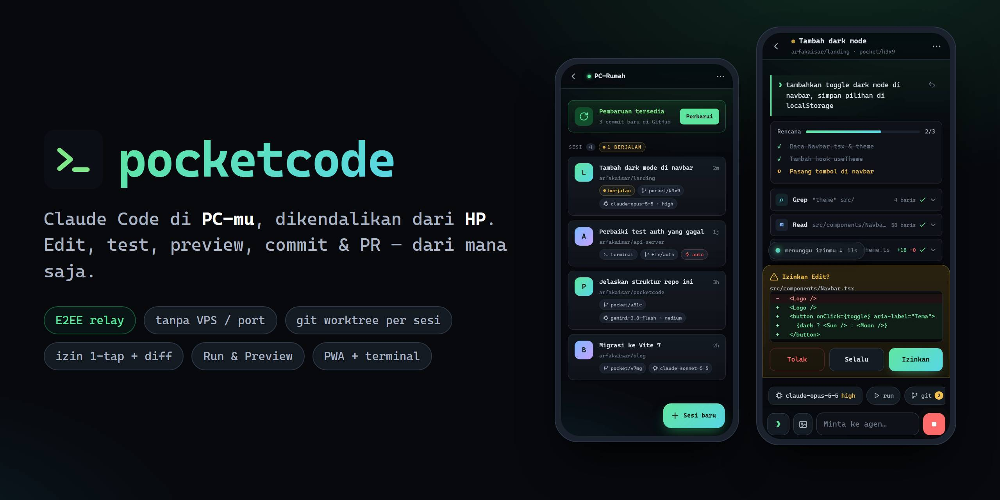

# pocketcode

**Coding agent Claude Code yang berjalan di PC-mu, dikendalikan penuh dari HP.**
Analisis repo, edit kode, jalankan test, preview web app, commit, push, dan buat Pull Request — sambil rebahan, di jalan, atau di mana saja.

[](https://nodejs.org)
[](#lisensi)
[](#-keamanan)
[](#-instalasi-di-pc)
[-f2c14e)](#-pakai-dari-hp)

[Fitur](#-fitur-utama) · [Cara kerja](#-cara-kerja) · [Instalasi](#-instalasi-di-pc) · [Pakai dari HP](#-pakai-dari-hp) · [Terminal](#-terminal-pocketcode) · [Keamanan](#-keamanan) · [FAQ](#-faq)

</div>

---

## Kenapa pocketcode?

Coding agent seperti Claude Code sangat membantu, tapi kamu harus duduk di depan PC. **pocketcode** memindahkan "remote control"-nya ke HP, sementara semua pekerjaan berat tetap di PC:

| | |
|---|---|
| 💻 **Compute tetap di PC** | Kode, `node_modules`, Docker, compiler, dan build berjalan di komputermu sendiri. HP hanya berfungsi sebagai remote control. |
| 🌐 **Tanpa setup jaringan** | Tidak perlu VPS, IP publik, port forwarding, VPN, Tailscale, atau ngrok. PC dan HP sama-sama membuka koneksi *keluar* ke relay. |
| 🔐 **End-to-end encrypted** | Pairing PIN dengan PAKE (CPace/ristretto255), lalu setiap pesan dienkripsi XChaCha20-Poly1305. Relay tidak bisa membaca apa pun. |
| 🔑 **Kredensial tidak keluar dari PC** | API key AI dan token GitHub hanya tersimpan di `~/.pocketcode`, tidak pernah dikirim ke HP maupun relay. |
| 🌿 **Aman untuk repo-mu** | Setiap sesi bekerja di `git worktree` dan branch terpisah, jadi branch utama tetap bersih sampai kamu memutuskan merge. |
| 🔁 **Satu sesi, dua layar** | Mulai di terminal PC, lanjutkan di HP, atau sebaliknya. Keduanya tersinkron secara real time. |

---

## 📱 Tampilan

<table>
<tr>
<td align="center" width="33%">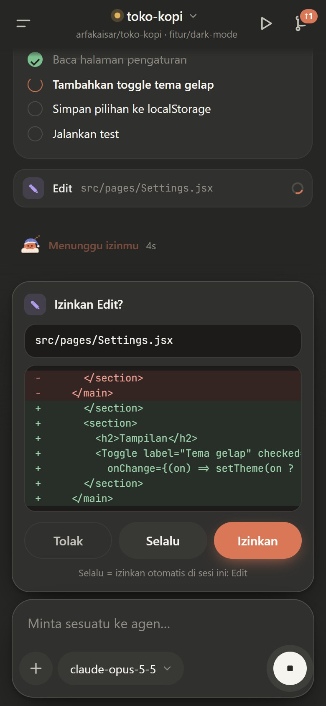<br><sub><b>Sesi agen</b> — streaming tool, rencana, dan izin 1-tap dengan diff</sub></td>
<td align="center" width="33%">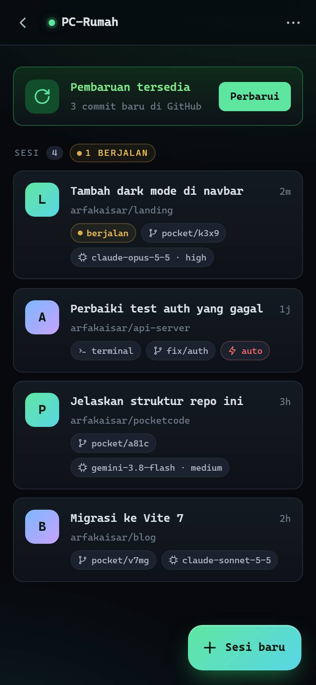<br><sub><b>Daftar sesi</b> — sesi dari HP & terminal, status, model, branch</sub></td>
<td align="center" width="33%">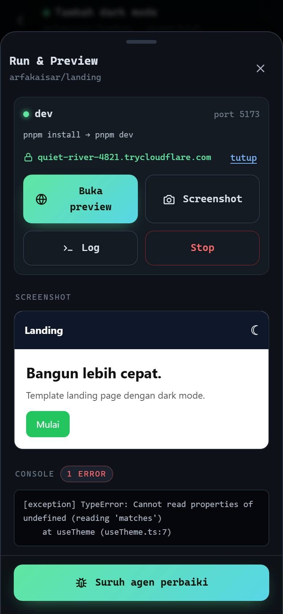<br><sub><b>Run & Preview</b> — dev server di PC, dibuka dari HP, plus screenshot & error console</sub></td>
</tr>
<tr>
<td align="center">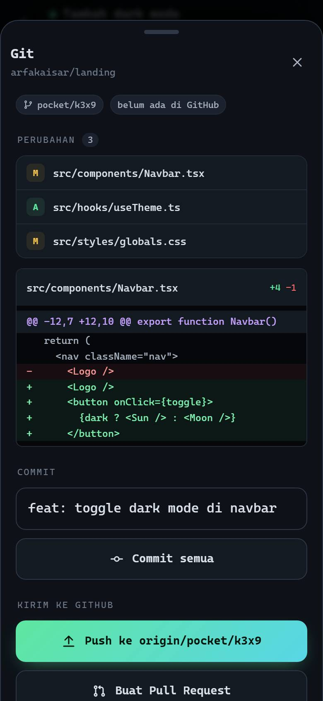<br><sub><b>Git</b> — status, diff berwarna, commit, push, dan Pull Request</sub></td>
<td align="center">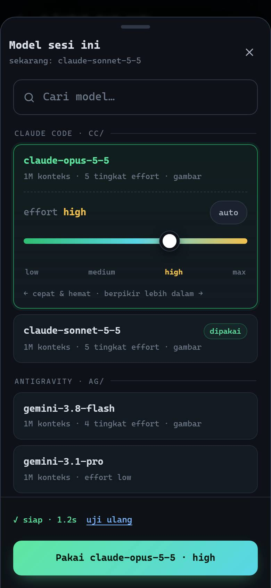<br><sub><b>Model & effort</b> — pilih model, atur effort dengan slider, model diuji otomatis</sub></td>
<td align="center">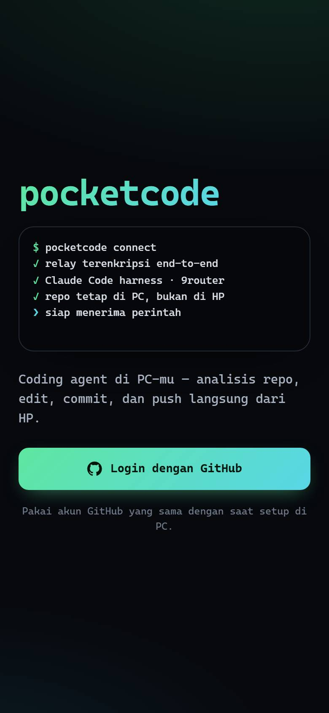<br><sub><b>Login</b> — masuk dengan GitHub, pairing dengan PIN sekali</sub></td>
</tr>
</table>

<p align="center">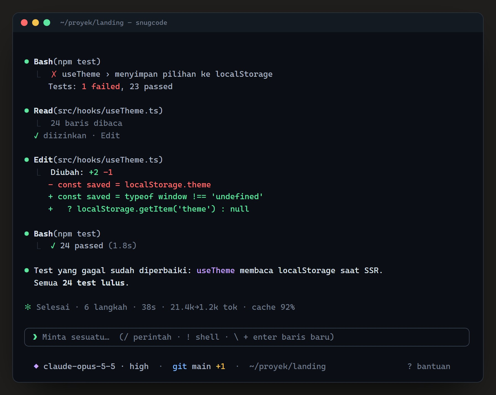<br><sub><b>Terminal UI</b> (<code>pocketcode</code>) — pengalaman seperti <code>claude</code>, dengan sesi yang sama seperti di HP</sub></p>

> Gambar di atas adalah mockup dengan data contoh dari tampilan versi sebelumnya; sumbernya ada di [`docs/mockups/`](docs/mockups). Tampilan PWA kini bergaya aplikasi chat (tema terang/gelap, drawer, composer kartu).

---

## ✨ Fitur utama

**Agen & kolaborasi**
- 🤖 **Claude Code Agent SDK** dengan model dari **9router** (Claude, Gemini, dan lainnya), termasuk subagen, web search, dan tool lainnya. Konfigurasi agen dirampingkan: setiap request ke model ±55% lebih kecil (±77 KB → ±35 KB per langkah).
- 🪶 **Subagen hemat**: subagen (Explore, Plan, …) otomatis memakai **Claude Haiku 5.5** atau **Gemini 3.8 Flash** dengan effort rendah, bukan model utama.
- ✅ **Izin 1-tap**: perintah shell meminta *Izinkan / Selalu / Tolak*. *Selalu* berlaku per pola perintah (mis. `npm test *`), bukan untuk semua Bash.
- ✏️ **Edit langsung diterapkan** di worktree sesi (bisa di-rewind kapan saja). Nyalakan *Tinjau edit* (menu sesi / `/edits`) untuk menyetujui setiap diff.
- ⚡ **Auto-izin**: biarkan agen bekerja mandiri. `git push` dan `gh pr create` tetap selalu meminta izin.
- ☰ **Mode rencana**: agen hanya membaca lalu mengajukan rencana. Kamu bisa menyetujui atau meminta revisi.
- ❓ **Agen bisa bertanya**: pertanyaan pilihan dijawab dengan sekali tap.
- 🖼 **Kirim gambar**: screenshot atau foto dari kamera/galeri (maks. 4 per pesan).
- ↺ **Checkpoint & rewind**: kembalikan semua file ke kondisi sebelum prompt mana pun.
- `!` **Shell langsung**: `!npm test`, `!git status`, dengan output di-stream ke HP.

**Run & Preview**
- ▶ **Dev server di latar belakang**: perintah setup/dev terdeteksi otomatis (npm/pnpm/yarn/…), dengan log live dan deteksi port.
- 🌍 **Preview di HP** lewat tunnel pribadi bertoken. Hot reload (HMR) Vite/Next tetap berjalan.
- 📸 **Screenshot + error console** dari Chrome/Edge headless di PC, lalu sekali tap untuk *"Suruh agen perbaiki"*.
- 👀 Agen bisa **melihat hasil UI-nya sendiri** (`dev_start`, `preview_screenshot`) untuk verifikasi.

**Git & GitHub**
- ⎇ Clone repo GitHub-mu ke PC, satu worktree dan branch per sesi.
- Status, diff berwarna, commit, push, dan **Pull Request**, semuanya dari HP.

**Sistem**
- 🔔 **Web Push** saat agen selesai, butuh izin, atau bertanya, walaupun PWA sedang ditutup.
- ☕ **Anti-sleep** selama sesi aktif (Windows Away Mode / `caffeinate` / `systemd-inhibit`).
- ⬆ **Update jarak jauh 1-tap** dari HP, dengan banner otomatis saat ada commit baru.
- ◆ **Pemilih model** dengan slider effort (`low → max`) dan uji kesehatan model otomatis.

---

## 🧭 Cara kerja

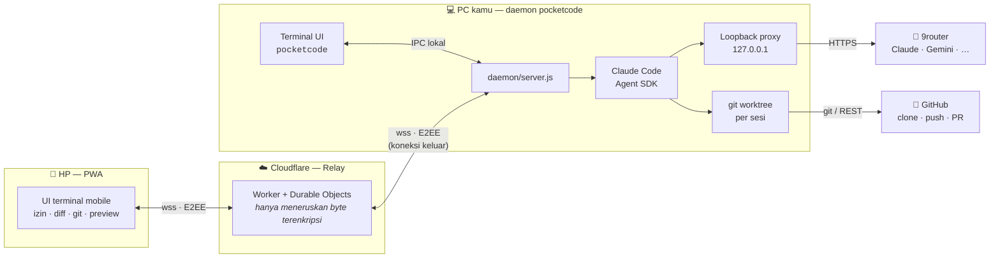

1. **Daemon** berjalan di latar belakang PC (otomatis saat login) dan membuka WebSocket *keluar* ke relay.
2. **HP** membuka PWA, login GitHub, lalu memasangkan diri dengan PC memakai **PIN** (cukup sekali).
3. Setiap prompt dari HP dikirim terenkripsi ke PC, lalu **Claude Agent SDK** mengerjakannya di worktree sesi.
4. Event agen (teks, tool, permintaan izin) di-stream balik ke HP **dan** ke terminal secara real time.

### Alur satu prompt

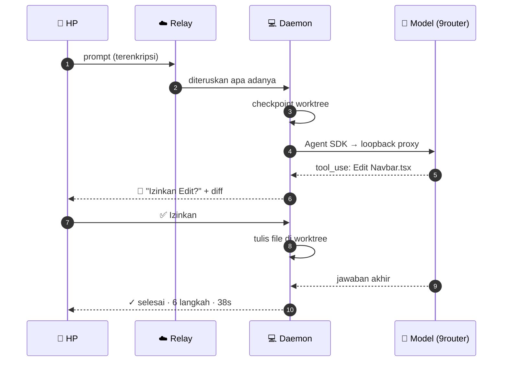

### Isolasi sesi dengan git worktree

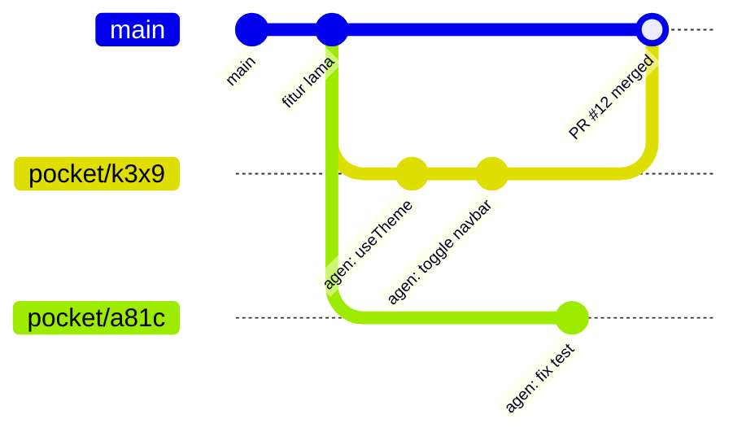

Setiap sesi mendapat folder `~/.pocketcode/workspaces/<owner>__<repo>/s-<id>` dengan branch sendiri (default `pocket/<id>`). Beberapa sesi bisa berjalan paralel di repo yang sama tanpa saling ganggu.

---

## 🚀 Instalasi di PC

**Kebutuhan:** [Node.js 22+](https://nodejs.org), [git](https://git-scm.com), akun GitHub, dan **API key 9router**.

```bash
npm i -g github:arfakaisar/pocketcode
pocketcode setup
pocketcode autostart on
```

`pocketcode setup` akan menanyakan:

1. **API key 9router** (`https://router.gemz.space/v1`), lalu model utama (model ringan subagen dipilih otomatis).
2. **Cara login GitHub** untuk clone, push, dan PR. Disarankan *login lewat browser/HP*.
3. **Nama PC** dan **PIN** (6–12 huruf/angka, tidak peka huruf besar/kecil, misal `moon42`).
4. Lalu tampil **satu link** (menautkan PC ke akun GitHub-mu) dan **satu kode** (login GitHub untuk PC). Keduanya boleh dibuka dari HP.

`pocketcode autostart on` menjalankan daemon di latar belakang sekarang juga, dan otomatis setiap kali login ke Windows, macOS, atau Linux.

> [!TIP]
> Tanpa install global: `npx github:arfakaisar/pocketcode setup`, lalu `npx github:arfakaisar/pocketcode start`.

> [!NOTE]
> PC harus menyala selama dipakai dari HP. pocketcode mencegah PC tertidur selama sesi aktif, tapi kalau PC tertidur karena idle, ubah pengaturan sleep: di Windows, Settings → System → Power → Sleep: *Never* (saat dicolok).

---

## 📲 Pakai dari HP

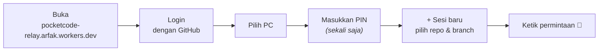

1. Buka **https://pocketcode-relay.arfak.workers.dev** di browser HP, lalu **Login dengan GitHub** (akun yang sama dengan setup PC).
2. Pilih PC, lalu masukkan PIN.
3. Menu browser → **Add to Home screen**, supaya terbuka layar penuh seperti aplikasi dan notifikasi push berjalan (wajib di iOS).

### Kontrol di layar sesi

| Kontrol | Fungsi |
|---|---|
| **☰** (kiri atas) atau geser dari tepi kiri | Drawer: sesi baru, beranda, sesi terbaru, ganti PC, akun & tema |
| **Judul sesi ▾** | Menu sesi: rincian branch/model, git, run, ganti model, simpan `.env`, hapus sesi |
| **▶ / 🌐** (kanan atas) | Run & Preview: dev server, log, screenshot, link preview (titik hijau = preview aktif) |
| **⎇** (kanan atas) | Git: status, diff, commit, push, Pull Request (badge = jumlah file berubah) |
| **+** (composer) | Lampiran & alat: kamera, galeri, mode rencana, mode shell, auto-izin, tinjau edit, aksi cepat |
| **Nama model ▾** (composer) | Ganti model & effort di tengah sesi (berlaku mulai pesan berikutnya) |
| **Pil mode** di atas input | Mode yang aktif (Rencana / Shell / Auto-izin); ketuk untuk mematikan |
| **!** di awal pesan | Jalankan sebagai perintah shell |
| **↺ rewind** (di bawah pesanmu) | Kembalikan semua file ke sebelum prompt itu |
| **■** | Hentikan agen |
| Tekan lama sesi (beranda) | Buka / hapus sesi |
| Tarik ke bawah (daftar) | Muat ulang |

### Model & effort

- Varian effort yang di 9router berupa ID terpisah (misal `ag/gemini-3.8-flash-low` / `-medium` / `-high`) digabung jadi **satu model dengan slider effort**.
- Model Claude (`cc/claude-opus-5-5`, `cc/claude-sonnet-5-5`) mendapat slider virtual *auto · low · medium · high · max*.
- Ganti model/effort di tengah sesi langsung berlaku di proses agen yang sama (tanpa restart).
- **Model ringan (subagen)** dipilih otomatis dan tidak bisa diganti: model utama Claude (`cc/`) → Claude Haiku 5.5, lalu Gemini 3.8 Flash; model lain (`ag/`, …) → Gemini 3.8 Flash, lalu Claude Haiku 5.5. Bila keduanya tidak ada di router, subagen memakai model utama.
- Ringkasan selesai menampilkan **cache %**: porsi input yang dibaca dari prompt cache. Selalu 0% berarti provider di 9router tidak meng-cache, sehingga setiap langkah ditagih penuh.
- Setiap model yang dipilih **diuji otomatis** dengan satu pesan kecil. Ini menangkap model yang sudah dihentikan tapi masih membalas "sukses".
- Hanya model yang mendukung tool calling yang ditampilkan.

### Run & Preview

Ketuk **▶** di kanan atas → **Jalankan**. Perintah setup (`npm ci`, `pnpm install`, …) dan dev (`npm run dev`, …) terdeteksi otomatis, atau bisa ditetapkan per repo lewat `.pocketcode.json`:

```json
{ "setup": "pnpm install", "dev": "pnpm dev --port {port}" }
```

Env `PORT` diisi port bebas, dan `{port}` diganti dengan port yang sama. **Preview di HP** membuka Cloudflare quick tunnel ke gerbang lokal yang dilindungi token rahasia (dikirim hanya lewat kanal E2EE). Tanpa token, link ditolak. Tunnel tertutup otomatis saat proses berhenti.

> [!TIP]
> File `.env` tidak ikut di worktree baru. Buka menu sesi → **Simpan .env sebagai template**, maka file itu dipulihkan otomatis di setiap sesi baru repo yang sama.

---

## ⌨ Terminal: `pocketcode`

```bash
cd proyek-kamu
pocketcode                     # atau singkatnya: pocket
pocketcode "jelaskan repo ini" # langsung kirim prompt
pocketcode --pick              # pilih sesi lain (termasuk sesi dari HP)
```

- Folder repo git tempat kamu menjalankan `pocketcode` langsung menjadi sesinya, tanpa clone. Sesi terakhir di folder itu otomatis dilanjutkan.
- **Sesi di terminal dan di HP adalah sesi yang sama.** Sesi dari terminal ditandai "terminal" di aplikasi HP.
- Daemon dinyalakan otomatis kalau belum berjalan.

| Tombol | Fungsi |
|---|---|
| `enter` | kirim; saat agen bekerja, pesan masuk antrean |
| `\` + `enter` / `alt+enter` | baris baru |
| `!` | mode shell (perintah langsung di folder sesi) |
| `/` | perintah: `/model` `/sessions` `/new` `/run` `/preview` `/logs` `/plan` `/rewind` `/git` `/diff` `/commit` `/push` `/pr` `/auto` `/edits` `/update` `/help` … |
| `esc` | hentikan agen |
| `ctrl+o` | output lengkap tool terakhir |
| `ctrl+c` ×2 | keluar (sesi tetap berjalan di PC) |

Di `/model`, gunakan ↑↓ untuk memilih model dan ←→ untuk mengatur effort.

### Perintah CLI

| Perintah | Fungsi |
|---|---|
| `pocketcode` / `pocket` | UI terminal |
| `pocketcode setup` | Setup / ubah konfigurasi |
| `pocketcode login` | Login ulang GitHub saja |
| `pocketcode start` | Jalankan daemon di terminal ini |
| `pocketcode stop` / `restart` | Hentikan / restart daemon latar belakang |
| `pocketcode update` | Periksa dan pasang pembaruan |
| `pocketcode autostart on\|off` | Jalankan di latar belakang + otomatis saat login |
| `pocketcode clean` | Pindai & bersihkan worktree / repo yatim |
| `pocketcode pin` | Ganti PIN dan buka kunci setelah PIN salah berkali-kali |
| `pocketcode devices` | Daftar HP yang sudah dipasangkan |
| `pocketcode revoke <id\|all>` | Cabut akses HP |
| `pocketcode status` | Ringkasan konfigurasi |

<details>
<summary><b>📁 Lokasi data di PC</b></summary>

Semua data disimpan di `~/.pocketcode` (bisa diganti dengan env `POCKETCODE_HOME`):

```
~/.pocketcode/
├── config.json          # nama PC, relay, model default, …
├── secrets.json         # key 9router, token GitHub, PIN (hash), device secret HP
├── daemon.log           # log daemon latar belakang
├── workspaces/
│   └── <owner>__<repo>/
│       ├── _base/       # clone dasar
│       └── s-<id>/      # worktree per sesi
├── sessions/            # riwayat event per sesi (JSONL)
├── env/                 # template .env per repo
├── bin/                 # cloudflared (diunduh otomatis)
└── claude/              # CLAUDE_CONFIG_DIR terpisah dari Claude Code pribadimu
```
</details>

---

## 🔒 Keamanan

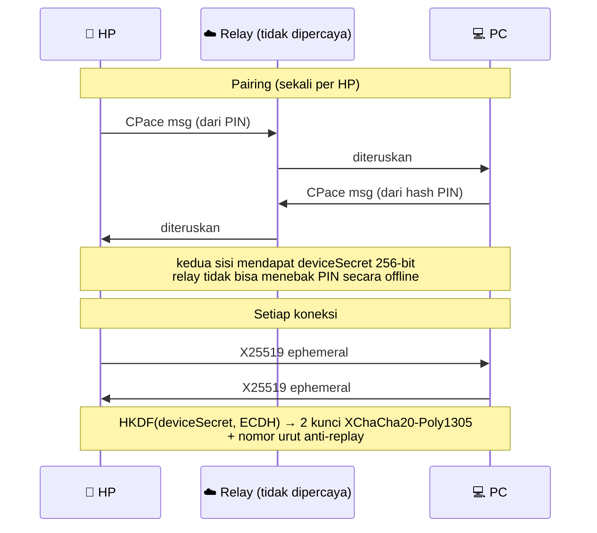

- **Relay zero-knowledge**: tidak pernah melihat PIN, isi percakapan, kode, key 9router, atau token GitHub.
- **Brute-force dibatasi**: setelah 5 kali PIN salah, pairing terkunci sampai `pocketcode pin` dijalankan di PC.
- **Token GitHub** disuntikkan lewat env hanya ke perintah git milik daemon. Token tidak ditulis ke `.git/config` dan tidak terlihat oleh agen.
- **Key 9router tidak pernah masuk ke proses agen.** Proses `claude` (dan Bash agen) hanya memegang token lokal acak; loopback proxy (`127.0.0.1`) menukarnya dengan key asli. Request tanpa token itu ditolak, jadi program lain di PC tidak bisa memakai key-mu.
- **`~/.pocketcode` tertutup untuk agen**: Read/Write/Edit/Glob/Grep ke folder data (key, token, secret perangkat, template `.env`) selalu ditolak, juga saat auto-izin. Pengecualian hanya worktree sesi dan membaca folder config Claude milik agen sendiri. Perintah Bash yang menyebut `secrets.json` selalu meminta izin.
- **Tanpa izin hanya yang aman**: tool baca lolos otomatis hanya di dalam worktree sesi. Membaca di luar worktree dan `WebFetch` meminta izin (atau auto-izin), agar prompt injection dari README/issue tidak bisa diam-diam mengirim file ke luar.
- **Aksi ke remote** (`git push`, `gh pr create|merge`, `gh repo create|delete`, …) selalu meminta izin, juga saat auto-izin aktif.

> [!WARNING]
> `CLAUDE.md` dan `.claude/settings.json` dari repo ikut dimuat, termasuk hook di dalamnya. Pakai hanya untuk repo yang kamu percaya. Deteksi perintah push berbasis pola teks: ini pengaman dari kekeliruan agen, bukan sandbox.

---

## 🗂 Struktur repo

```
pocketcode/
├── daemon/      # CLI, daemon, sesi Agent SDK, proxy, git, TUI, run & preview, updater
├── relay/       # Cloudflare Worker + Durable Objects (Hub, Pending)
├── web/         # PWA (vanilla JS, tanpa framework)
├── shared/      # kriptografi (CPace, X25519, XChaCha20) & normalisasi model
├── scripts/     # build PWA ke relay
├── test/        # unit, integrasi worktree, simulasi HP end-to-end
└── docs/        # gambar & mockup dokumentasi
```

Penjelasan arsitektur yang lebih mendalam ada di [`master.md`](master.md), dan riwayat perubahan di [`CHANGELOG.md`](CHANGELOG.md).

---

## 🛠 Pengembangan lokal

```bash
npm install && (cd relay && npm install)
printf 'TOKEN_SECRET=dev\n' > relay/.dev.vars
npm run dev:relay                         # relay + PWA di http://127.0.0.1:8787, login dev tanpa GitHub

POCKETCODE_HOME=/tmp/pc node daemon/cli.js setup --relay http://127.0.0.1:8787 \
  --key <key 9router> --model gemini/gemini-3.8-flash --skip-github --pin 123456 --name DevPC
POCKETCODE_HOME=/tmp/pc node daemon/cli.js start

npm test                                   # unit test
npm run typecheck                          # tsc --checkJs: daemon, shared, PWA, relay
node test/e2e-phone.mjs                    # simulasi HP: pairing → sesi → agen → git
npm run test:e2e                           # HP → relay dev → daemon → Agent SDK → mock 9router (tanpa key asli)
npm run test:ui                            # PWA hasil build di Chrome + TUI di pseudo-terminal (setelah build:web)
node test/worktree.it.mjs                  # skenario branch/worktree (butuh internet)
```

<details>
<summary><b>Untuk pemilik: deploy relay</b></summary>

Relay (Worker `pocketcode-relay`) dan OAuth App GitHub sudah disiapkan. Untuk deploy ulang setelah mengubah `relay/` atau `web/`:

```bash
npm install && (cd relay && npm install)
CLOUDFLARE_API_TOKEN=<token> npm run deploy
```

Secret relay di Cloudflare: `GITHUB_CLIENT_SECRET` dan `TOKEN_SECRET`. Kalau `TOKEN_SECRET` diganti, semua login HP dan PC harus diulang.
</details>

---

## ❓ FAQ

<details>
<summary><b>Apakah kodeku dikirim ke server pocketcode?</b></summary>

Tidak. Kode tetap di PC. Yang lewat relay hanya pesan terenkripsi end-to-end yang tidak bisa dibaca relay. Kode hanya dikirim ke penyedia model AI (lewat 9router) sebagai konteks agen, sama seperti memakai Claude Code biasa.
</details>

<details>
<summary><b>HP bilang "Menunggu PC" terus.</b></summary>

Pastikan daemon berjalan (`pocketcode status`, atau `pocketcode autostart on`) dan PC tidak tertidur. Log ada di `~/.pocketcode/daemon.log`. Halaman di HP tersambung otomatis begitu PC online.
</details>

<details>
<summary><b>PIN-ku terkunci.</b></summary>

Jalankan `pocketcode pin` di PC untuk mengganti PIN dan membuka kunci.
</details>

<details>
<summary><b>Bisa dipakai beberapa PC atau beberapa HP?</b></summary>

Bisa. Satu akun GitHub bisa menautkan banyak PC, dan setiap PC bisa dipasangkan dengan banyak HP. Lihat atau cabut HP dengan `pocketcode devices` / `pocketcode revoke`.
</details>

<details>
<summary><b>Apakah mengganggu instalasi Claude Code pribadiku?</b></summary>

Tidak. pocketcode memakai `CLAUDE_CONFIG_DIR` sendiri di `~/.pocketcode/claude`.
</details>

<details>
<summary><b>Screenshot/preview tidak jalan.</b></summary>

Screenshot butuh Chrome, Edge, Chromium, atau Brave di PC (atau isi `browserExecutable` di `~/.pocketcode/config.json`). Preview memakai `cloudflared`, yang diunduh otomatis ke `~/.pocketcode/bin`.
</details>

---

## 🗺 Roadmap

- [x] Relay E2EE (CPace + XChaCha20-Poly1305)
- [x] Git worktree per sesi, commit/push/PR dari HP
- [x] Terminal UI dengan sesi bersama HP
- [x] Run & Preview, screenshot, dan agen yang memverifikasi UI sendiri
- [x] Web Push, kirim gambar, mode rencana, checkpoint & rewind
- [x] Update jarak jauh 1-tap
- [ ] Integrasi keychain OS untuk `secrets.json`
- [ ] Terminal interaktif (PTY) penuh di HP
- [ ] Tunnel preview E2EE lewat relay sendiri
- [ ] File explorer ringan & review diff per hunk

---

## Lisensi

[MIT](package.json)

<div align="center"><sub>Dibuat untuk ngoding dari mana saja. <code>❯_</code></sub></div>
