<div align="center">


<br>

**Coding agent Claude Code yang berjalan di PC-mu, dikendalikan penuh dari HP.**<br>
Analisis repo, edit kode, jalankan test, preview web app, commit, push, dan buat Pull Request dari mana saja.

<br>

[](https://nodejs.org)
[](#lisensi)
[](#keamanan)
[](#instalasi-di-pc)
[](#pakai-dari-hp)

**[Instalasi](#instalasi-di-pc)** &nbsp;·&nbsp; [Demo](#lihat-cara-kerjanya) &nbsp;·&nbsp; [Fitur](#fitur) &nbsp;·&nbsp; [Arsitektur](#arsitektur) &nbsp;·&nbsp; [Terminal](#terminal-snugcode) &nbsp;·&nbsp; [Keamanan](#keamanan) &nbsp;·&nbsp; [FAQ](#faq)

<sub>Dulu bernama <b>pocketcode</b> — lihat <a href="#migrasi-dari-pocketcode">Migrasi dari pocketcode</a>.</sub>

</div>

<br>

## Lihat cara kerjanya

<table>
<tr>
<td width="58%" valign="top">

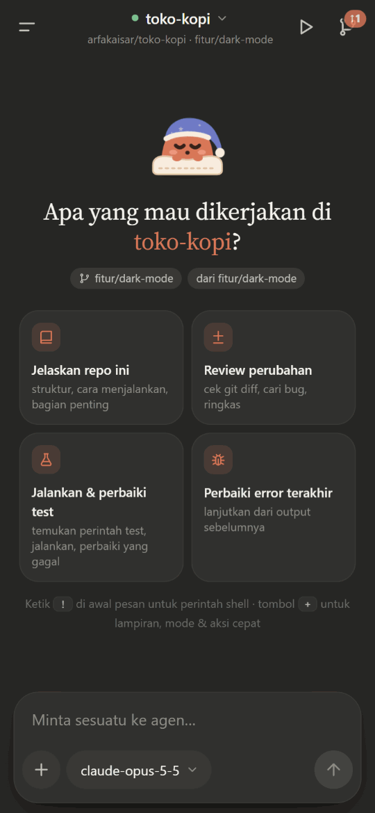

</td>
<td width="42%" valign="top">

### Dari prompt sampai test lulus

Ketik permintaan di HP. Agen di PC menyusun rencana, membaca kode, lalu meminta izin sebelum mengubah file — lengkap dengan diff-nya.

Setiap izin cukup **satu ketukan**. Perintah shell seperti `npm test` berjalan di PC-mu sendiri, dengan `node_modules`, toolchain, dan environment yang sudah ada.

Di akhir, ringkasan menampilkan jumlah langkah, durasi, token, porsi cache, dan biaya.

<sub>Rekaman layar aplikasi asli: PWA di Chromium terhadap daemon snugcode dan mock model.</sub>

</td>
</tr>
</table>

<table>
<tr>
<td width="50%" align="center" valign="top">
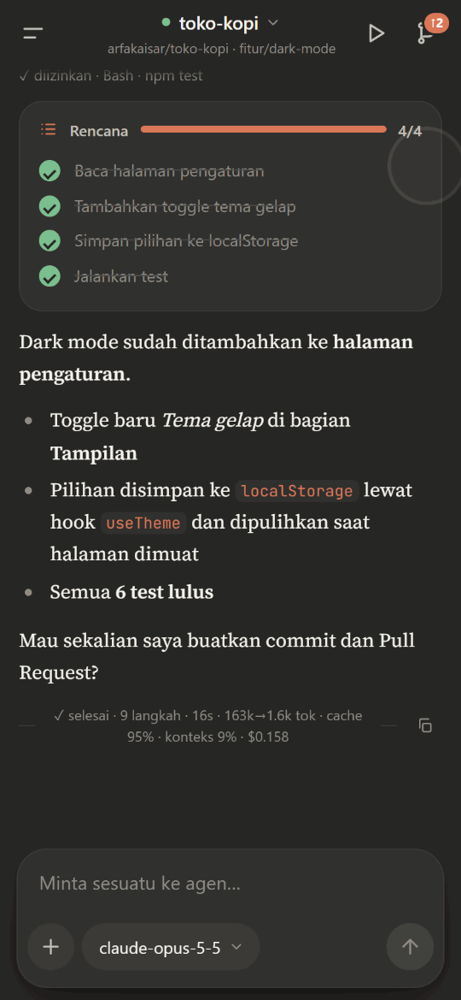<br>
<b>Run & Preview</b><br>
<sub>Dev server jalan di PC, screenshot diambil Chrome di PC, error console langsung bisa diserahkan ke agen.</sub>
</td>
<td width="50%" align="center" valign="top">
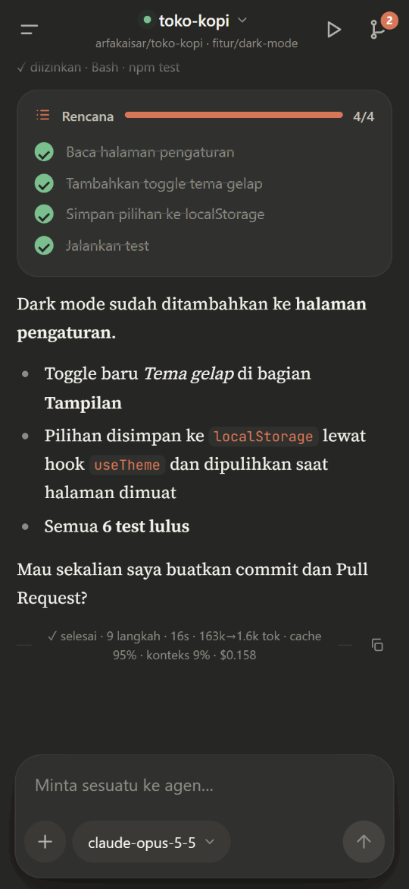<br>
<b>Git dari HP</b><br>
<sub>Status, diff berwarna per file, commit, push, dan Pull Request tanpa membuka laptop.</sub>
</td>
</tr>
</table>

<p align="center">
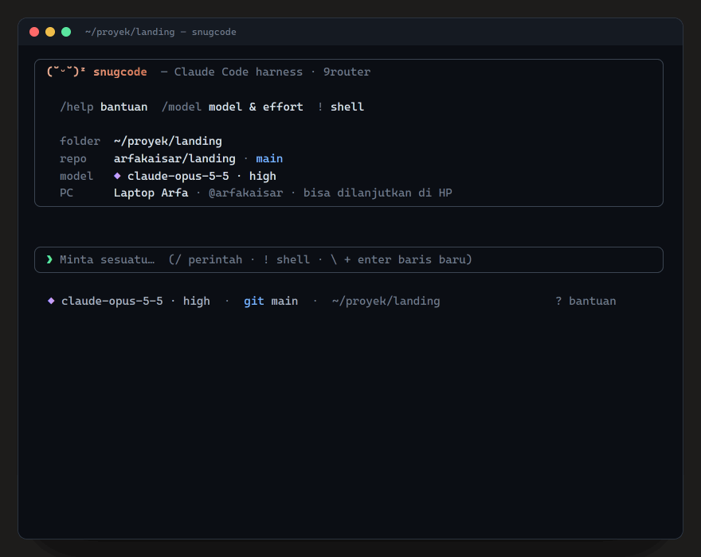<br>
<b>Terminal UI</b> &nbsp;<code>snugcode</code><br>
<sub>Pengalaman seperti <code>claude</code> di terminal. Sesinya sama dengan yang di HP: mulai di meja, lanjutkan di jalan.</sub>
</p>

---

## Kenapa snugcode?

Coding agent seperti Claude Code sangat membantu, tapi kamu harus duduk di depan PC. **snugcode** memindahkan kendalinya ke HP, sementara semua pekerjaan berat tetap di PC.

<table>
<tr>
<td width="33%" valign="top">

**Compute tetap di PC**<br>
<sub>Kode, `node_modules`, Docker, compiler, dan build berjalan di komputermu. HP hanya remote control.</sub>

</td>
<td width="33%" valign="top">

**Tanpa setup jaringan**<br>
<sub>Tidak perlu VPS, IP publik, port forwarding, VPN, atau ngrok. PC dan HP sama-sama membuka koneksi *keluar* ke relay.</sub>

</td>
<td width="33%" valign="top">

**End-to-end encrypted**<br>
<sub>Pairing PIN dengan PAKE (CPace / ristretto255), lalu setiap pesan dienkripsi XChaCha20-Poly1305. Relay tidak bisa membaca apa pun.</sub>

</td>
</tr>
<tr>
<td valign="top">

**Kredensial tidak keluar dari PC**<br>
<sub>API key AI dan token GitHub hanya tersimpan di `~/.snugcode`, tidak pernah dikirim ke HP maupun relay.</sub>

</td>
<td valign="top">

**Aman untuk repo-mu**<br>
<sub>Setiap sesi bekerja di `git worktree` dan branch sendiri. Branch utama tetap bersih sampai kamu memutuskan merge.</sub>

</td>
<td valign="top">

**Satu sesi, dua layar**<br>
<sub>Mulai di terminal PC, lanjutkan di HP, atau sebaliknya. Keduanya tersinkron secara real time.</sub>

</td>
</tr>
</table>

---

## Tampilan

Tangkapan layar mengikuti tema GitHub-mu: tema gelap atau terang.

<table>
<tr>
<td align="center" width="33%" valign="top">
<picture><source media="(prefers-color-scheme: light)" srcset="docs/images/sessions-light.jpg"></picture><br>
<b>Beranda</b><br><sub>Sesi dari HP & terminal, status, branch, model</sub>
</td>
<td align="center" width="33%" valign="top">
<picture><source media="(prefers-color-scheme: light)" srcset="docs/images/session-light.jpg"></picture><br>
<b>Izin dengan diff</b><br><sub>Rencana, tool yang berjalan, dan izin 1-tap</sub>
</td>
<td align="center" width="33%" valign="top">
<picture><source media="(prefers-color-scheme: light)" srcset="docs/images/summary-light.jpg">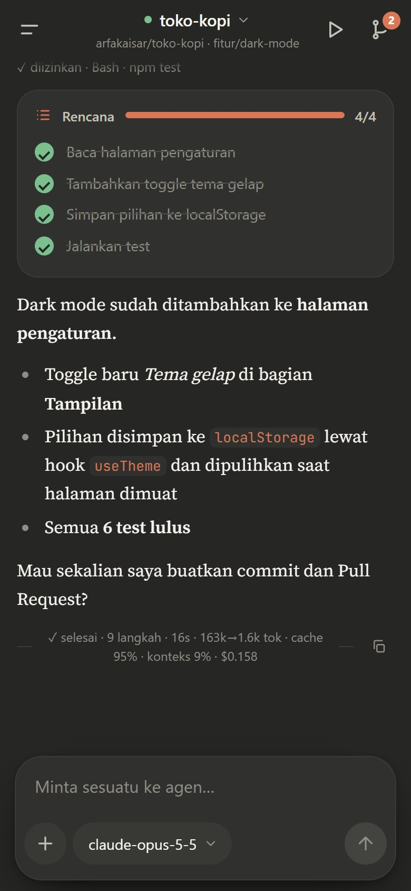</picture><br>
<b>Ringkasan</b><br><sub>Rencana selesai, jawaban, token, cache & biaya</sub>
</td>
</tr>
<tr>
<td align="center" valign="top">
<picture><source media="(prefers-color-scheme: light)" srcset="docs/images/diff-light.jpg">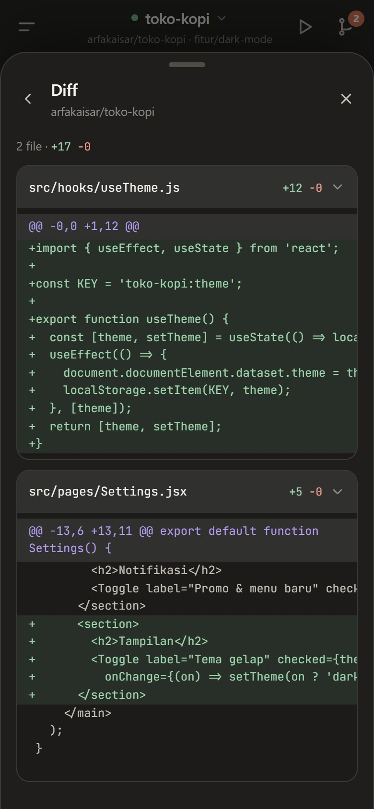</picture><br>
<b>Diff</b><br><sub>Perubahan per file, bisa dilipat</sub>
</td>
<td align="center" valign="top">
<picture><source media="(prefers-color-scheme: light)" srcset="docs/images/run-light.jpg"></picture><br>
<b>Run & Preview</b><br><sub>Dev server, log, preview lewat tunnel bertoken</sub>
</td>
<td align="center" valign="top">
<picture><source media="(prefers-color-scheme: light)" srcset="docs/images/preview-light.jpg">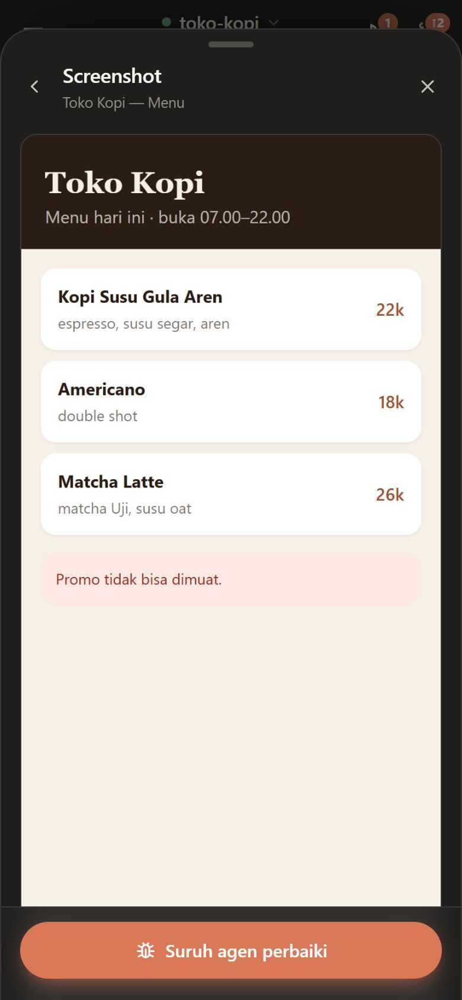</picture><br>
<b>Screenshot</b><br><sub>Dirender Chrome di PC, plus error console</sub>
</td>
</tr>
<tr>
<td align="center" valign="top">
<picture><source media="(prefers-color-scheme: light)" srcset="docs/images/model-light.jpg"></picture><br>
<b>Model & effort</b><br><sub>Ganti model di tengah sesi, slider effort</sub>
</td>
<td align="center" valign="top">
<picture><source media="(prefers-color-scheme: light)" srcset="docs/images/drawer-light.jpg">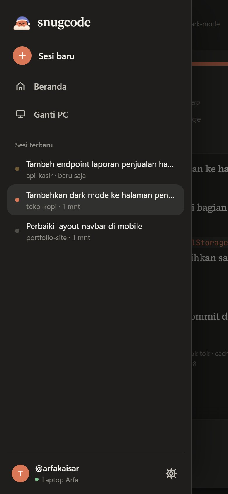</picture><br>
<b>Navigasi</b><br><sub>Sesi terbaru, ganti PC, akun & tema</sub>
</td>
<td align="center" valign="top">
<picture><source media="(prefers-color-scheme: light)" srcset="docs/images/login-light.jpg"></picture><br>
<b>Login</b><br><sub>Masuk dengan GitHub, pairing PIN sekali</sub>
</td>
</tr>
</table>

<sub>Semua gambar dibuat ulang dengan `npm run docs:images` (lihat [`scripts/docs-images.mjs`](scripts/docs-images.mjs)) dari UI asli dengan repo contoh. Hero dan terminal dirender dari [`docs/mockups/`](docs/mockups).</sub>

---

## Fitur

<table>
<tr>
<td width="50%" valign="top">

#### Agen & kolaborasi

- **Claude Code Agent SDK** dengan model dari **9router** (Claude, Gemini, dan lainnya), termasuk subagen, web search, dan tool lain. Konfigurasi agen dirampingkan: setiap request ±55% lebih kecil.
- **Subagen hemat** — Explore, Plan, dan lainnya otomatis memakai **Claude Haiku 5.5** atau **Gemini 3.8 Flash** dengan effort rendah.
- **Izin 1-tap** — *Izinkan / Selalu / Tolak*. *Selalu* berlaku per pola perintah (mis. `npm test *`), bukan untuk semua Bash.
- **Edit langsung diterapkan** di worktree sesi dan bisa di-rewind. Nyalakan *Tinjau edit* (`/edits`) untuk menyetujui setiap diff.
- **Auto-izin** untuk kerja mandiri; `git push` dan `gh pr create` tetap selalu meminta izin.
- **Mode rencana** — agen membaca lalu mengajukan rencana untuk disetujui atau direvisi.
- **Agen bisa bertanya** — pertanyaan pilihan dijawab dengan sekali tap.
- **Kirim gambar** dari kamera atau galeri (maks. 4 per pesan).
- **Checkpoint & rewind** ke kondisi sebelum prompt mana pun.
- **Shell langsung** — `!npm test`, `!git status`, output di-stream ke HP.

</td>
<td width="50%" valign="top">

#### Run & Preview

- **Dev server di latar belakang** — perintah setup/dev terdeteksi otomatis (npm / pnpm / yarn / …), log live, deteksi port.
- **Preview di HP** lewat tunnel pribadi bertoken; HMR Vite/Next tetap berjalan.
- **Screenshot + error console** dari Chrome/Edge headless di PC, lalu *Suruh agen perbaiki*.
- Agen bisa **melihat hasil UI-nya sendiri** (`dev_start`, `preview_screenshot`) untuk verifikasi.

#### Git & GitHub

- Clone repo GitHub-mu ke PC, satu worktree dan branch per sesi.
- Status, diff, commit, push, dan **Pull Request** dari HP.

#### Sistem

- **Web Push** saat agen selesai, butuh izin, atau bertanya — juga saat PWA ditutup.
- **Anti-sleep** selama sesi aktif (Away Mode / `caffeinate` / `systemd-inhibit`).
- **Update jarak jauh 1-tap** dari HP, dengan banner saat ada versi baru.
- **Pemilih model** dengan slider effort (`low → max`) dan uji kesehatan model otomatis.
- **Tema gelap & terang**, mengikuti sistem atau dipilih manual.

</td>
</tr>
</table>

---

## Arsitektur

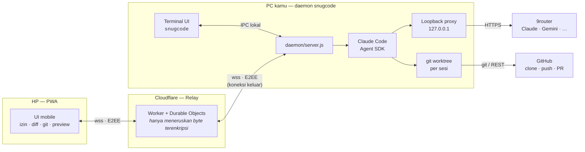

1. **Daemon** berjalan di latar belakang PC (otomatis saat login) dan membuka WebSocket *keluar* ke relay.
2. **HP** membuka PWA, login GitHub, lalu memasangkan diri dengan PC memakai **PIN** (cukup sekali).
3. Setiap prompt dari HP dikirim terenkripsi ke PC, lalu **Claude Agent SDK** mengerjakannya di worktree sesi.
4. Event agen (teks, tool, permintaan izin) di-stream balik ke HP **dan** ke terminal secara real time.

<details>
<summary><b>Alur satu prompt</b></summary>

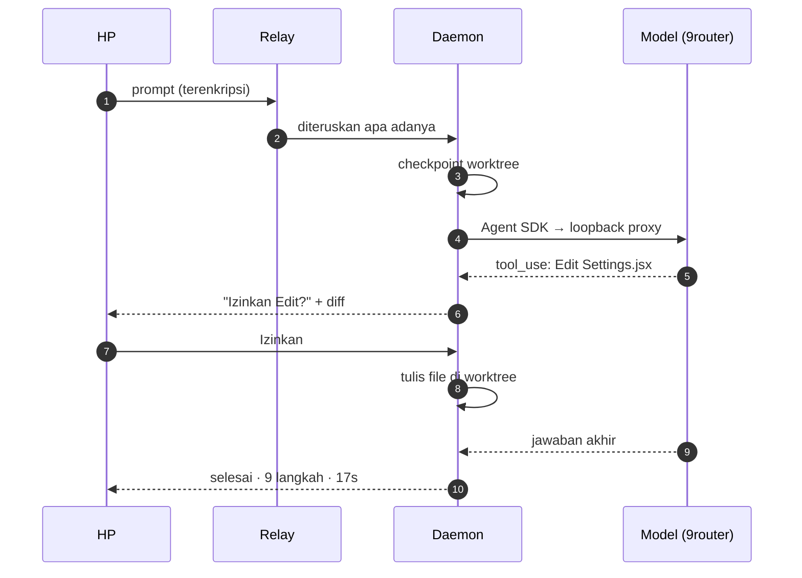
</details>

<details>
<summary><b>Isolasi sesi dengan git worktree</b></summary>

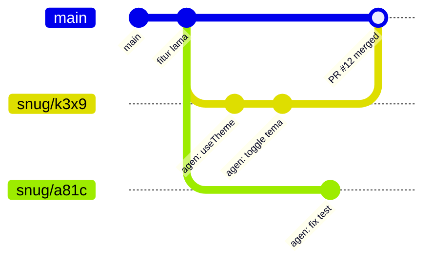

Setiap sesi mendapat folder `~/.snugcode/workspaces/<owner>__<repo>/s-<id>` dengan branch sendiri (default `snug/<id>`). Beberapa sesi bisa berjalan paralel di repo yang sama tanpa saling ganggu.
</details>

---

## Instalasi di PC

**Kebutuhan:** [Node.js 22+](https://nodejs.org), [git](https://git-scm.com), akun GitHub, dan **API key 9router**.

```bash
npm i -g github:arfakaisar/snugcode
snugcode setup
snugcode autostart on
```

`snugcode setup` akan menanyakan:

1. **API key 9router** (`https://router.gemz.space/v1`), lalu model utama (model ringan subagen dipilih otomatis).
2. **Cara login GitHub** untuk clone, push, dan PR. Disarankan *login lewat browser/HP*.
3. **Nama PC** dan **PIN** (6–12 huruf/angka, tidak peka huruf besar/kecil, misal `moon42`).
4. Lalu tampil **satu link** (menautkan PC ke akun GitHub-mu) dan **satu kode** (login GitHub untuk PC). Keduanya boleh dibuka dari HP.

`snugcode autostart on` menjalankan daemon di latar belakang sekarang juga, dan otomatis setiap kali login ke Windows, macOS, atau Linux.

> [!TIP]
> Tanpa install global: `npx github:arfakaisar/snugcode setup`, lalu `npx github:arfakaisar/snugcode start`.

> [!NOTE]
> PC harus menyala selama dipakai dari HP. snugcode mencegah PC tertidur selama sesi aktif, tapi kalau PC tertidur karena idle, ubah pengaturan sleep: di Windows, Settings → System → Power → Sleep: *Never* (saat dicolok).

---

## Pakai dari HP

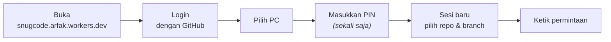

1. Buka **https://snugcode.arfak.workers.dev** di browser HP, lalu **Login dengan GitHub** (akun yang sama dengan setup PC).
2. Pilih PC, lalu masukkan PIN.
3. Menu browser → **Add to Home screen**, supaya terbuka layar penuh seperti aplikasi dan notifikasi push berjalan (wajib di iOS).

### Kontrol di layar sesi

| Kontrol | Fungsi |
|---|---|
| Tombol menu (kiri atas) atau geser dari tepi kiri | Drawer: sesi baru, beranda, sesi terbaru, ganti PC, akun & tema |
| **Judul sesi** | Menu sesi: rincian branch/model, git, run, ganti model, simpan `.env`, hapus sesi |
| Ikon *play* (kanan atas) | Run & Preview: dev server, log, screenshot, link preview |
| Ikon *branch* (kanan atas) | Git: status, diff, commit, push, Pull Request (badge = jumlah file berubah) |
| **+** di composer | Lampiran & alat: kamera, galeri, mode rencana, mode shell, auto-izin, tinjau edit, aksi cepat |
| **Nama model** di composer | Ganti model & effort di tengah sesi (berlaku mulai pesan berikutnya) |
| Pil mode di atas input | Mode yang aktif (Rencana / Shell / Auto-izin); ketuk untuk mematikan |
| `!` di awal pesan | Jalankan sebagai perintah shell |
| **rewind** di bawah pesanmu | Kembalikan semua file ke sebelum prompt itu |
| Tombol stop | Hentikan agen |
| Tekan lama sesi (beranda) | Buka / hapus sesi |
| Tarik ke bawah (daftar) | Muat ulang |

### Model & effort

- Varian effort yang di 9router berupa ID terpisah (misal `ag/gemini-3.8-flash-low` / `-medium` / `-high`) digabung jadi **satu model dengan slider effort**.
- Model Claude (`cc/claude-opus-5-5`, `cc/claude-sonnet-5-5`) mendapat slider virtual *auto · low · medium · high · max*.
- Ganti model/effort di tengah sesi langsung berlaku di proses agen yang sama (tanpa restart).
- **Model ringan (subagen)** dipilih otomatis: model utama Claude (`cc/`) → Claude Haiku 5.5, lalu Gemini 3.8 Flash; model lain (`ag/`, …) → Gemini 3.8 Flash, lalu Claude Haiku 5.5. Bila keduanya tidak ada di router, subagen memakai model utama.
- Ringkasan selesai menampilkan **cache %**: porsi input yang dibaca dari prompt cache. Selalu 0% berarti provider di 9router tidak meng-cache, sehingga setiap langkah ditagih penuh.
- Setiap model yang dipilih **diuji otomatis** dengan satu pesan kecil, untuk menangkap model yang sudah dihentikan tapi masih membalas "sukses".
- Hanya model yang mendukung tool calling yang ditampilkan.

### Run & Preview

Ketuk ikon *play* di kanan atas → **Jalankan**. Perintah setup (`npm ci`, `pnpm install`, …) dan dev (`npm run dev`, …) terdeteksi otomatis, atau bisa ditetapkan per repo lewat `.snugcode.json`:

```json
{ "setup": "pnpm install", "dev": "pnpm dev --port {port}" }
```

Env `PORT` diisi port bebas, dan `{port}` diganti dengan port yang sama. **Preview di HP** membuka Cloudflare quick tunnel ke gerbang lokal yang dilindungi token rahasia (dikirim hanya lewat kanal E2EE). Tanpa token, link ditolak. Tunnel tertutup otomatis saat proses berhenti.

> [!TIP]
> File `.env` tidak ikut di worktree baru. Buka menu sesi → **Simpan .env sebagai template**, maka file itu dipulihkan otomatis di setiap sesi baru repo yang sama.

---

## Terminal: `snugcode`

```bash
cd proyek-kamu
snugcode                     # atau singkatnya: snug
snugcode "jelaskan repo ini" # langsung kirim prompt
snugcode --pick              # pilih sesi lain (termasuk sesi dari HP)
```

- Folder repo git tempat kamu menjalankan `snugcode` langsung menjadi sesinya, tanpa clone. Sesi terakhir di folder itu otomatis dilanjutkan.
- **Sesi di terminal dan di HP adalah sesi yang sama.** Sesi dari terminal ditandai "terminal" di aplikasi HP.
- Daemon dinyalakan otomatis kalau belum berjalan.

| Tombol | Fungsi |
|---|---|
| `enter` | kirim; saat agen bekerja, pesan masuk antrean |
| `\` + `enter` / `alt+enter` | baris baru |
| `!` | mode shell (perintah langsung di folder sesi) |
| `/` | perintah: `/model` `/sessions` `/new` `/run` `/preview` `/logs` `/plan` `/rewind` `/git` `/diff` `/commit` `/push` `/pr` `/auto` `/edits` `/update` `/help` … |
| `esc` | hentikan agen |
| `ctrl+o` | output lengkap tool terakhir |
| `ctrl+c` ×2 | keluar (sesi tetap berjalan di PC) |

Di `/model`, gunakan ↑↓ untuk memilih model dan ←→ untuk mengatur effort.

### Perintah CLI

| Perintah | Fungsi |
|---|---|
| `snugcode` / `snug` | UI terminal |
| `snugcode setup` | Setup / ubah konfigurasi |
| `snugcode login` | Login ulang GitHub saja |
| `snugcode start` | Jalankan daemon di terminal ini |
| `snugcode stop` / `restart` | Hentikan / restart daemon latar belakang |
| `snugcode update` | Periksa dan pasang pembaruan |
| `snugcode autostart on\|off` | Jalankan di latar belakang + otomatis saat login |
| `snugcode clean` | Pindai & bersihkan worktree / repo yatim |
| `snugcode pin` | Ganti PIN dan buka kunci setelah PIN salah berkali-kali |
| `snugcode devices` | Daftar HP yang sudah dipasangkan |
| `snugcode revoke <id\|all>` | Cabut akses HP |
| `snugcode status` | Ringkasan konfigurasi |

<details>
<summary><b>Lokasi data di PC</b></summary>

Semua data disimpan di `~/.snugcode` (bisa diganti dengan env `SNUGCODE_HOME`). Instalasi lama yang sudah punya `~/.pocketcode` tetap memakai folder itu:

```
~/.snugcode/
├── config.json          # nama PC, relay, model default, …
├── secrets.json         # key 9router, token GitHub, PIN (hash), device secret HP
├── daemon.log           # log daemon latar belakang
├── workspaces/
│   └── <owner>__<repo>/
│       ├── _base/       # clone dasar
│       └── s-<id>/      # worktree per sesi
├── sessions/            # riwayat event per sesi (JSONL)
├── env/                 # template .env per repo
├── bin/                 # cloudflared (diunduh otomatis)
└── claude/              # CLAUDE_CONFIG_DIR terpisah dari Claude Code pribadimu
```
</details>

---

## Keamanan

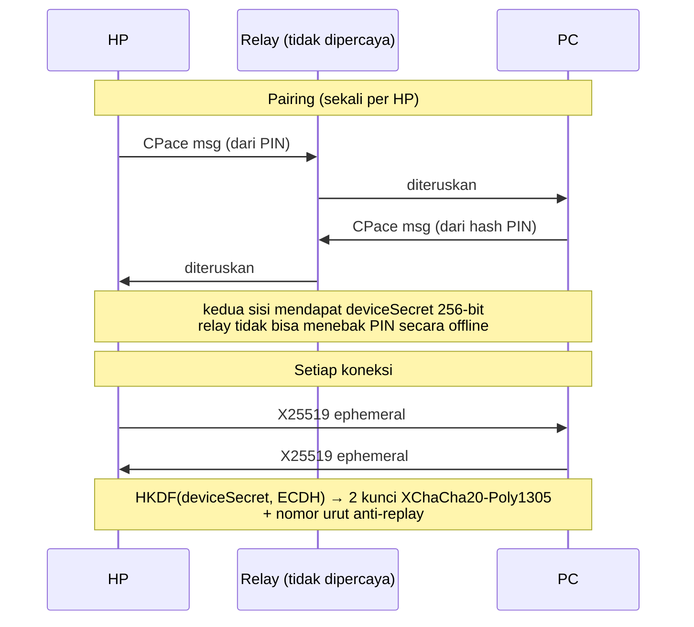

- **Relay zero-knowledge** — tidak pernah melihat PIN, isi percakapan, kode, key 9router, atau token GitHub.
- **Brute-force dibatasi** — setelah 5 kali PIN salah, pairing terkunci sampai `snugcode pin` dijalankan di PC.
- **Token GitHub** disuntikkan lewat env hanya ke perintah git milik daemon. Token tidak ditulis ke `.git/config` dan tidak terlihat oleh agen.
- **Key 9router tidak pernah masuk ke proses agen.** Proses `claude` (dan Bash agen) hanya memegang token lokal acak; loopback proxy (`127.0.0.1`) menukarnya dengan key asli. Request tanpa token itu ditolak, jadi program lain di PC tidak bisa memakai key-mu.
- **`~/.snugcode` tertutup untuk agen** — Read/Write/Edit/Glob/Grep ke folder data (key, token, secret perangkat, template `.env`) selalu ditolak, juga saat auto-izin. Pengecualian hanya worktree sesi dan folder config Claude milik agen sendiri. Perintah Bash yang menyebut `secrets.json` selalu meminta izin.
- **Tanpa izin hanya yang aman** — tool baca lolos otomatis hanya di dalam worktree sesi. Membaca di luar worktree dan `WebFetch` meminta izin (atau auto-izin), agar prompt injection dari README/issue tidak bisa diam-diam mengirim file ke luar.
- **Aksi ke remote** (`git push`, `gh pr create|merge`, `gh repo create|delete`, …) selalu meminta izin, juga saat auto-izin aktif.

> [!WARNING]
> `CLAUDE.md` dan `.claude/settings.json` dari repo ikut dimuat, termasuk hook di dalamnya. Pakai hanya untuk repo yang kamu percaya. Deteksi perintah push berbasis pola teks: ini pengaman dari kekeliruan agen, bukan sandbox.

---

## Struktur repo

```
snugcode/
├── daemon/      # CLI, daemon, sesi Agent SDK, proxy, git, TUI, run & preview, updater
├── relay/       # Cloudflare Worker + Durable Objects (Hub, Pending)
├── web/         # PWA (vanilla JS, tanpa framework)
├── shared/      # kriptografi (CPace, X25519, XChaCha20), model event & normalisasi model
├── scripts/     # build PWA ke relay, ikon, gambar dokumentasi
├── test/        # unit, integrasi worktree, simulasi HP end-to-end, uji UI
└── docs/        # gambar, GIF & mockup dokumentasi
```

Penjelasan arsitektur yang lebih mendalam ada di [`master.md`](master.md), dan riwayat perubahan di [`CHANGELOG.md`](CHANGELOG.md).

---

## Pengembangan lokal

```bash
npm install && (cd relay && npm install)
printf 'TOKEN_SECRET=dev\n' > relay/.dev.vars
npm run dev:relay                         # relay + PWA di http://127.0.0.1:8787, login dev tanpa GitHub

SNUGCODE_HOME=/tmp/pc node daemon/cli.js setup --relay http://127.0.0.1:8787 \
  --key <key 9router> --model gemini/gemini-3.8-flash --skip-github --pin 123456 --name DevPC
SNUGCODE_HOME=/tmp/pc node daemon/cli.js start

npm test                                   # unit test
npm run typecheck                          # tsc --checkJs: daemon, shared, PWA, relay
node test/e2e-phone.mjs                    # simulasi HP: pairing → sesi → agen → git
npm run test:e2e                           # HP → relay dev → daemon → Agent SDK → mock 9router (tanpa key asli)
npm run test:ui                            # PWA hasil build di Chrome + TUI di pseudo-terminal (setelah build:web)
node test/worktree.it.mjs                  # skenario branch/worktree (butuh internet)
npm run docs:images                        # buat ulang gambar & GIF README (butuh relay dev berjalan)
```

<details>
<summary><b>Untuk pemilik: deploy relay</b></summary>

Relay (Worker `snugcode-relay`) dan OAuth App GitHub sudah disiapkan. Untuk deploy ulang setelah mengubah `relay/` atau `web/`:

```bash
npm install && (cd relay && npm install)
CLOUDFLARE_API_TOKEN=<token> npm run deploy
```

Secret relay di Cloudflare: `GITHUB_CLIENT_SECRET` dan `TOKEN_SECRET`. Kalau `TOKEN_SECRET` diganti, semua login HP dan PC harus diulang.
</details>

---

## Migrasi dari pocketcode

snugcode adalah nama baru pocketcode. Protokol, data, dan pairing tidak berubah:

- **Folder data** `~/.pocketcode` tetap dipakai bila sudah ada (pairing HP, sesi, worktree, riwayat agen). Instalasi baru memakai `~/.snugcode`.
- **Alamat aplikasi** kini `https://snugcode.arfak.workers.dev`: worker alias `snugcode` menyajikan PWA dan meneruskan API & WebSocket ke worker relay lama lewat service binding, jadi akun, PC tertaut, dan data tidak berubah. PC yang masih memakai URL lama tetap tersambung. Di alamat lama, PWA menawarkan **Pindah sekarang** (login, pairing PC, dan tema ikut dipindahkan, tanpa login/PIN lagi) dan halaman login dialihkan ke alamat baru.
- Env `POCKETCODE_*`, file `.pocketcode.json`, dan entri autostart lama tetap dikenali; autostart lama dipindahkan otomatis.

Pembaruan jarak jauh dari daemon versi lama **tidak** bisa pindah sendiri ke paket baru, jadi tiap PC perlu dimigrasi sekali. Aplikasi HP menampilkan banner **"Pindahkan PC ini ke snugcode"** yang bisa menjalankannya lewat sesi, atau jalankan sendiri di terminal PC:

```bash
# macOS / Linux
npm i -g github:arfakaisar/snugcode --include=optional && { pocketcode stop; npm rm -g pocketcode; snugcode autostart on; }
```

```powershell
# Windows (PowerShell)
npm i -g github:arfakaisar/snugcode --include=optional; if ($?) { pocketcode stop; npm rm -g pocketcode; snugcode autostart on }
```

> [!IMPORTANT]
> **Callback OAuth App GitHub** harus menunjuk alamat baru: GitHub → Settings → Developer settings → OAuth Apps → (aplikasi snugcode) → *Authorization callback URL* = `https://snugcode.arfak.workers.dev/auth/callback`. OAuth App hanya mengizinkan satu host, karena itu login selalu dilakukan di alamat baru.

> [!NOTE]
> Repo GitHub perlu diganti namanya menjadi `snugcode` (Settings → Repository name). GitHub otomatis mengalihkan URL lama, jadi `git push` dan pembaruan dari PC yang belum dimigrasi tetap jalan.

---

## FAQ

<details>
<summary><b>Apakah kodeku dikirim ke server snugcode?</b></summary>

Tidak. Kode tetap di PC. Yang lewat relay hanya pesan terenkripsi end-to-end yang tidak bisa dibaca relay. Kode hanya dikirim ke penyedia model AI (lewat 9router) sebagai konteks agen, sama seperti memakai Claude Code biasa.
</details>

<details>
<summary><b>HP bilang "Menunggu PC" terus.</b></summary>

Pastikan daemon berjalan (`snugcode status`, atau `snugcode autostart on`) dan PC tidak tertidur. Log ada di `~/.snugcode/daemon.log`. Halaman di HP tersambung otomatis begitu PC online.
</details>

<details>
<summary><b>PIN-ku terkunci.</b></summary>

Jalankan `snugcode pin` di PC untuk mengganti PIN dan membuka kunci.
</details>

<details>
<summary><b>Bisa dipakai beberapa PC atau beberapa HP?</b></summary>

Bisa. Satu akun GitHub bisa menautkan banyak PC, dan setiap PC bisa dipasangkan dengan banyak HP. Lihat atau cabut HP dengan `snugcode devices` / `snugcode revoke`.
</details>

<details>
<summary><b>Apakah mengganggu instalasi Claude Code pribadiku?</b></summary>

Tidak. snugcode memakai `CLAUDE_CONFIG_DIR` sendiri di `~/.snugcode/claude`.
</details>

<details>
<summary><b>Screenshot/preview tidak jalan.</b></summary>

Screenshot butuh Chrome, Edge, Chromium, atau Brave di PC (atau isi `browserExecutable` di `~/.snugcode/config.json`). Preview memakai `cloudflared`, yang diunduh otomatis ke `~/.snugcode/bin`.
</details>

---

## Roadmap

- [x] Relay E2EE (CPace + XChaCha20-Poly1305)
- [x] Git worktree per sesi, commit/push/PR dari HP
- [x] Terminal UI dengan sesi bersama HP
- [x] Run & Preview, screenshot, dan agen yang memverifikasi UI sendiri
- [x] Web Push, kirim gambar, mode rencana, checkpoint & rewind
- [x] Update jarak jauh 1-tap
- [x] Tema gelap & terang
- [ ] Integrasi keychain OS untuk `secrets.json`
- [ ] Terminal interaktif (PTY) penuh di HP
- [ ] Tunnel preview E2EE lewat relay sendiri
- [ ] File explorer ringan & review diff per hunk

---

## Lisensi

[MIT](package.json)

<br>

<div align="center"><br><sub>Dibuat untuk ngoding dari mana saja.</sub></div>
